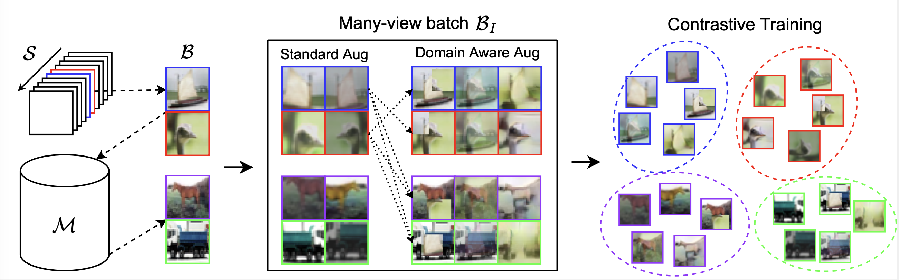

# Implementation of Domain Aware Augmentations
This repository contains the code of our paper titled *Domain-Aware Augmentations for Unsupervised Online General Continual Learning*.

## Paper link
https://proceedings.bmvc2023.org/452/

## Overall procedure



## Project structure
```bash
./checkpoints                   # Default checkpoints folder
./config
├── config_files                # Default config folder
│   ├── cifar10
│   ├── cifar100
│   └── tiny
├── parser.py                   # Argument parser code
└── stam_config.py              # STAM specific config file
./logs                          # Default log folder
./main.py                       # Main python interface file
./readme.md                     # This file
./requirements.txt
./src                     
├── buffers                     # Buffer/Memory specific code
│   ├── buffer.py
│   ├── fifo.py
│   ├── greedy.py
│   └── reservoir.py
├── datasets                    # Various dataset and their split versions
│   ├── cifar100.py
│   ├── cifar10.py
│   ├── fashion_mnist.py
│   ├── ImageNet.py
│   ├── __init__.py
│   ├── memory.py
│   ├── mnist.py
│   ├── number.py
│   ├── split_cifar100.py
│   ├── split_cifar10.py
│   ├── split_fashion.py
│   ├── split_ImageNet.py
│   ├── split_tiny.py
│   └── tinyImageNet.py
├── learners                    # Implemented methods
│   ├── aug.py                  # DAA learner
│   ├── baselines
│   │   ├── agem.py
│   │   ├── cassle.py
│   │   ├── er.py
│   │   ├── gdumb.py
│   │   ├── lump.py
│   │   ├── scr.py
│   │   └── stam
│   │       ├── STAM_classRepo.py
│   │       └── stam.py
│   ├── base.py                 # Standard augmentaitons are defined here
│   ├── ce.py
│   ├── simclr.py
│   └── supcon.py
├── models
│   └── resnet.py
└── utils
    ├── AdaIN
    │   ├── function.py
    │   ├── models
    │   │   ├── decoder.pth             # To [download](https://drive.google.com/file/d/1bMfhMMwPeXnYSQI6cDWElSZxOxc6aVyr/view?usp=sharing)
    │   │   └── vgg_normalised.pth      # To [download](https://drive.google.com/file/d/1EpkBA2K2eYILDSyPTt0fztz59UjAIpZU/view?usp=sharing)
    │   ├── net.py
    │   ├── README.md
    │   └── test.py
    ├── augment.py                      # Data augmentation
    ├── data.py
    ├── losses.py
    ├── metrics.py                      # CL metrics. TODO: Add RAA and RAF.
    ├── name_match.py
    ├── tensorboard.py
    └── utils.py
```

## Installation
It is recommended to use a virtualenv or docker to run this code. Corresponding dependencies can be found in `requirements.txt`. In you use pip you can run `pip install -r requirements.txt` to install required packages.

## Usage
Command line usage of the current repository is described here.
```bash
python main.py -h
usage: main.py [-h] [--config CONFIG] [--device {cpu,gpu}] [--train]
               [--epochs N] [--start-epoch N] [-b BATCH_SIZE]
               [--learning-rate LEARNING_RATE] [--parallel]
               [--momentum M] [--weight-decay W] [--optim {Adam,SGD}]
               [--test-freq TEST_FREQ] [--seed SEED] [--memory-only]
               [--supervised] [--tag TAG] [--tb-root TB_ROOT] [--verbose]
               [--logs-root LOGS_ROOT] [--results-root RESULTS_ROOT]
               [--tensorboard] [--save-freq SAVE_FREQ]
               [--ckpt-root CKPT_ROOT] [--resume]
               [--model-state MODEL_STATE] [--buffer-state BUFFER_STATE]
               [--test] [--backbone {resnet18,rrn}]
               [--nb-channels NB_CHANNELS] [--no-proj] [--proj]
               [--dataset {mnist,fmnist,cifar10,cifar100,tiny,sub}]
               [--data-root-dir DATA_ROOT_DIR] [--min-crop MIN_CROP]
               [--training-type {uni,inc}] [--n-classes N_CLASSES]
               [--img-size IMG_SIZE] [--num-workers NUM_WORKERS]
               [--data-norm] [--n-tasks N_TASKS]
               [--labels-order LABELS_ORDER [LABELS_ORDER ...]]
               [--temperature T] [--mem-size MEM_SIZE]
               [--mem-batch-size MEM_BATCH_SIZE] [--buffer BUFFER]
               [--drop-method {random}] [--learner LEARNER] [--eval-mem]
               [--eval-random] [--n-runs N_RUNS]
               [--start-seed START_SEED] [--run-id RUN_ID] [--kornia]
               [--no-kornia] [--lab-pc LAB_PC] [--mem-iters MEM_ITERS]
               [--aug] [--no-aug] [--n-augs N_AUGS] [--n-styles N_STYLES]
               [--tf-size TF_SIZE] [--min-mix MIN_MIX]
               [--max-mix MAX_MIX] [--mixup] [--n-mixup N_MIXUP]
               [--cutmix] [--n-cutmix N_CUTMIX] [--multi-style]
               [--style-samples STYLE_SAMPLES]
               [--min-style-alpha MIN_STYLE_ALPHA]
               [--max-style-alpha MAX_STYLE_ALPHA]

Pytorch implementation of Domain Aware Augmentations for Online Continual
Learning

optional arguments:
  -h, --help            show this help message and exit
  --config CONFIG       Path to the configuration file for the training
                        to launch.
  --device {cpu,gpu}    Device to train on.
  --train
  --epochs N            number of total epochs to run
  --start-epoch N       manual epoch number (useful on restarts)
  -b BATCH_SIZE, --batch-size BATCH_SIZE
                        stream batch size (default: 100)
  --learning-rate LEARNING_RATE, -lr LEARNING_RATE
                        Initial learning rate
  --parallel            Whether to use every GPU available or not
  --momentum M          momentum
  --weight-decay W, --wd W
                        weight decay (default: 1e-4)
  --optim {Adam,SGD}
  --test-freq TEST_FREQ
                        Nb batches between each save
  --seed SEED           Random seed to use.
  --memory-only, -mo    Training using only the memory ?
  --supervised          Pseudo labels or true labels ?
  --tag TAG, -t TAG     Base name for graphs and checkpoints
  --tb-root TB_ROOT     Where do you want tensorboards graphs ?
  --verbose, -v         Verbose logs.
  --logs-root LOGS_ROOT
                        Defalt root folder for writing logs.
  --results-root RESULTS_ROOT
                        Where you want to save the results ?
  --tensorboard
  --save-freq SAVE_FREQ
                        Frequency for saving models.
  --ckpt-root CKPT_ROOT
                        Directory where to save the model.
  --resume, -r          Resume old training. Setup model state and buffer
                        state.
  --model-state MODEL_STATE
                        Path/to/model/state.pth
  --buffer-state BUFFER_STATE
                        path/to/buffer/state.pth
  --test
  --backbone {resnet18,rrn}, -bb {resnet18,rrn}
                        Model backbone for contrastive training.
  --nb-channels NB_CHANNELS
                        Number of channels for the input image.
  --no-proj             Do not use a projection layer for smiclr.
  --proj                Use a projection layer for smiclr.
  --dataset {mnist,fmnist,cifar10,cifar100,tiny,sub}, -d {mnist,fmnist,cifar10,cifar100,tiny,sub}
                        Dataset to train on
  --data-root-dir DATA_ROOT_DIR
                        Root dir containing the dataset to train on.
  --min-crop MIN_CROP   Minimum size for cropping in standard data
                        augmentation. range (0-1)
  --training-type {uni,inc}
                        How to feed the data to the network (incremental
                        context or not)
  --n-classes N_CLASSES
                        Number of classes in database.
  --img-size IMG_SIZE   Size of the square input image
  --num-workers NUM_WORKERS, -w NUM_WORKERS
                        Number of workers to use for dataloader.
  --data-norm           Normalize input data?
  --n-tasks N_TASKS     How many tasks do you want?
  --labels-order LABELS_ORDER [LABELS_ORDER ...]
                        In which order to you want to see the labels?
                        Random if not specified.
  --temperature T       temperature parameter for softmax
  --mem-size MEM_SIZE   Memory size for continual learning
  --mem-batch-size MEM_BATCH_SIZE, -mbs MEM_BATCH_SIZE
                        How many images do you want to retrieve from the
                        memory/ltm
  --buffer BUFFER       What buffer do you want? See available buffers in
                        utils/name_match.py
  --drop-method {random}
                        How to drop images from memory when adding new
                        ones.
  --learner LEARNER     What learner do you want? See list of available
                        learners in utils/name_match.py
  --eval-mem
  --eval-random
  --n-runs N_RUNS       Number of runs, with different seeds each time.
  --start-seed START_SEED
                        First seed to use.
  --run-id RUN_ID       Id of the current run in multi run.
  --kornia
  --no-kornia
  --lab-pc LAB_PC       Number of labeled images per class to use in
                        unsupervised evaluation.
  --mem-iters MEM_ITERS
                        Number of times to make a grad update on memory
                        at each step
  --aug                 Wanna have a batch with all images augmented or
                        only half?
  --no-aug
  --n-augs N_AUGS
  --n-styles N_STYLES
  --tf-size TF_SIZE
  --min-mix MIN_MIX     Min proportion of the original image to keep when
                        using mixup or cutmix.
  --max-mix MAX_MIX     Max proportion of the original image to keep when
                        using mixup or cutmix.
  --mixup
  --n-mixup N_MIXUP     Numbers of mixup to consider.
  --cutmix
  --n-cutmix N_CUTMIX   Numbers of cutmix to consider.
  --multi-style
  --style-samples STYLE_SAMPLES
                        number of images to take the style from.
  --min-style-alpha MIN_STYLE_ALPHA
                        Min alpha value for style transfer.
  --max-style-alpha MAX_STYLE_ALPHA
                        Max alpha value for style transfer.
```

## Training
### In command line only
Training can be done by specifying parameters in command line, for example:
```
python main.py --results-root ./results/daa/tiny/ --data-root /data/dataset/torchvision --learner AUG --dataset tiny --mem-iters 1 --n-augs 4 --batch-size 100 --n-mixup 1 --n-styles 1 --n-cutmix 1
```

### Using a configuration file (recommended)
When using a configuration file, parameters specified in the .yaml cannot be overriten by command line arguments. However, other parameters like `--data-root` can be adapted to the users' need.

```
python main.py --results-root ./results/daa/tiny/ --data-root /data/dataset/torchvision --config config/config_files/tiny/4aug,1mixup,1cutmix,1style,tiny,mi20_m2000mbs200sbs100.yaml
```

### output example
Output of the command above should contain performances like this.
```bash
root - INFO - --------------------FORGETTING--------------------
root - INFO - ncm     0.0000   nan      nan      nan      nan      0.0000
root - INFO - ncm     0.2885   0.0000   nan      nan      nan      0.2885
root - INFO - ncm     0.2935   0.2225   0.0000   nan      nan      0.2580
root - INFO - ncm     0.4615   0.3190   0.0370   0.0000   nan      0.2725
root - INFO - ncm     0.5815   0.2155   0.1795   0.0250   0.0000   0.2504
root - INFO - --------------------ACCURACY--------------------
root - INFO - ncm     0.7750   nan      nan      nan      nan      0.7750
root - INFO - ncm     0.4865   0.5260   nan      nan      nan      0.5062
root - INFO - ncm     0.4815   0.3035   0.5150   nan      nan      0.4333
root - INFO - ncm     0.3135   0.2070   0.4780   0.2875   nan      0.3215
root - INFO - ncm     0.1935   0.3105   0.3355   0.2625   0.3045   0.2813
```        

### Methods name
Name of each methods can be slightly different between the one in the paper and the one in the tag of the configuration file. We give have the name and tag correspondence here.

| Name in paper | tag in configuration file |
|-------------- |---------------------------|
| offline       |     offline               |
| fine-tuned    |         finetune          |
|       ER      |       er                  |
|     SCR       |       scr                 |
|     AGEM      |       agem                |
|     GDUMB     |       gdumb               |
|     STAM      |       stam                |
|     LUMP      |         lump              |
|   SimCLR      |     2aug                  |
|   DAA (ours)  |4aug,1mixup,1cutmix,1style |  
|---------------|---------------------------|

## Cite

```latex
@inproceedings{Michel_2023_BMVC,
author={Michel, Nicolas and Negrel, Romain and Chierchia, Giovanni and Bercher, Jean-Fran{\c{c}}ois},
title     = {Domain-Aware Augmentations for Unsupervised Online General Continual Learning},
booktitle = {34th British Machine Vision Conference 2023, {BMVC} 2023, Aberdeen, UK, November 20-24, 2023},
publisher = {BMVA},
year      = {2023},
url       = {https://papers.bmvc2023.org/0452.pdf}
}
```